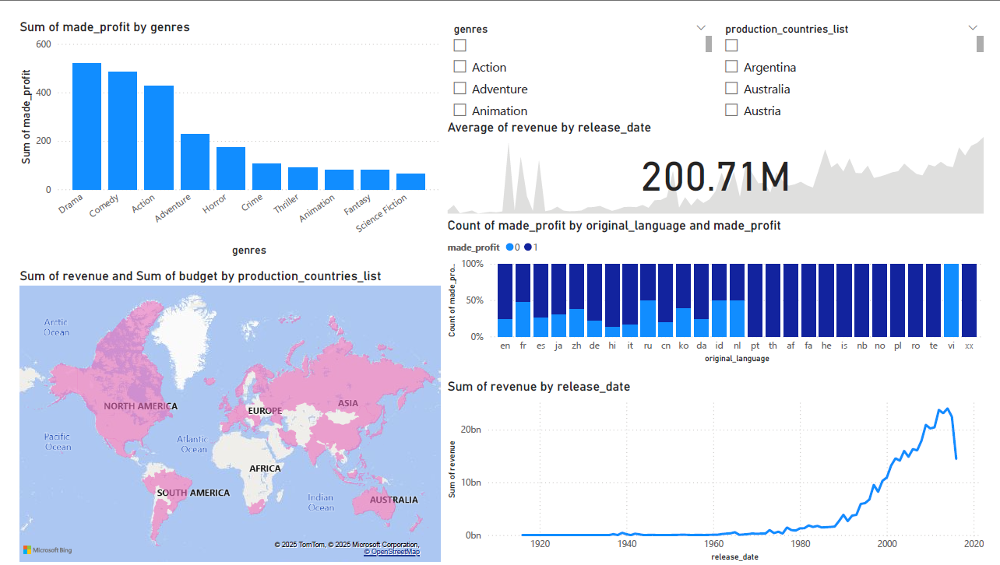
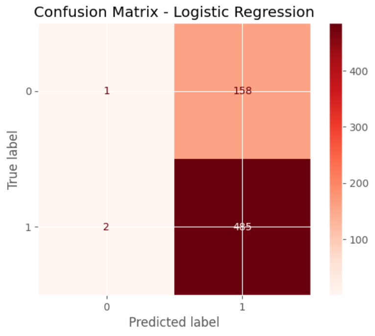

# 🎬 Movie Success Prediction – Full-Stack Data Project

This project predicts movie profitability based on features like budget, genre, production country, and more. It demonstrates a full-stack data pipeline from raw data to business insights using **SQL, Python (pandas, sklearn, XGBoost), and Power BI**.

---

## 📌 Objective

To explore what makes a movie successful and build a model that predicts profitability. Then, communicate key insights via a Power BI dashboard for stakeholders.

---

## 🧰 Tools Used

- **PostgreSQL** – Data cleaning, JSON normalization, and relational schema
- **Python** – EDA, feature engineering, and predictive modeling
- **scikit-learn + XGBoost** – Model training & evaluation
- **Power BI** – Interactive dashboard for business insights

---

## 🔄 Workflow

1. **SQL Data Cleaning**
   - Normalized JSON fields (e.g. genres, keywords, production companies)
   - Filtered out invalid rows (budget = 0, etc.)

2. **EDA + Feature Engineering**
   - Extracted date/year, simplified genre labels
   - Created a new binary column: `made_profit`

3. **Modeling**
   - Compared Logistic Regression, Random Forest, and XGBoost
   - Best model (XGBoost):  
     - **F1 Score**: 0.86  
     - **Recall**: 0.99

4. **Dashboard (Power BI)**
   - Visualized success % by language, genre, year
   - Included filters for genres, production countries

---

## 📊 Dashboard Preview

> 🟢 You can find the full `.pbix` file under `/dashboard`.

---

## 📈 Key Insights

- 🎭 **Horror, Western and Fantasy movies** tend to perform well.
- 📉 **Foreign and Documentary movies** tend to underperform. 
- 💰 Movies with **higher budgets** are more likely to be profitable.
- 🌍 Certain **production countries** like USA and UK dominate profitable outputs.
- 🧠 XGBoost delivered the best results with 86% F1 Score and 99% Recall.

---

## 📂 File Guide

| File/Folder              | Description                              |
|--------------------------|------------------------------------------|
| `sql/`                   | Data cleaning and normalization queries  |
| `notebooks/`             | Python notebooks for EDA & modeling      |
| `dashboard/`             | Power BI dashboard file                  |
| `data/`                  | Raw and cleaned CSV datasets             |
| `images/`                | Dashboard and model output screenshots   |
| `README.md`              | Project documentation                    |

---

## 🙋‍♂️ Author

**Ramandeep**  
